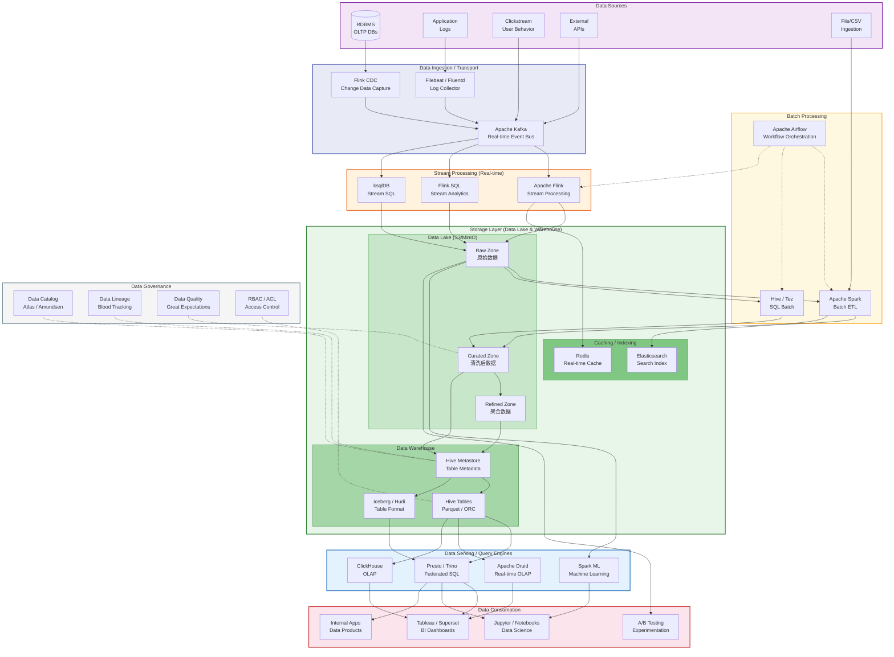
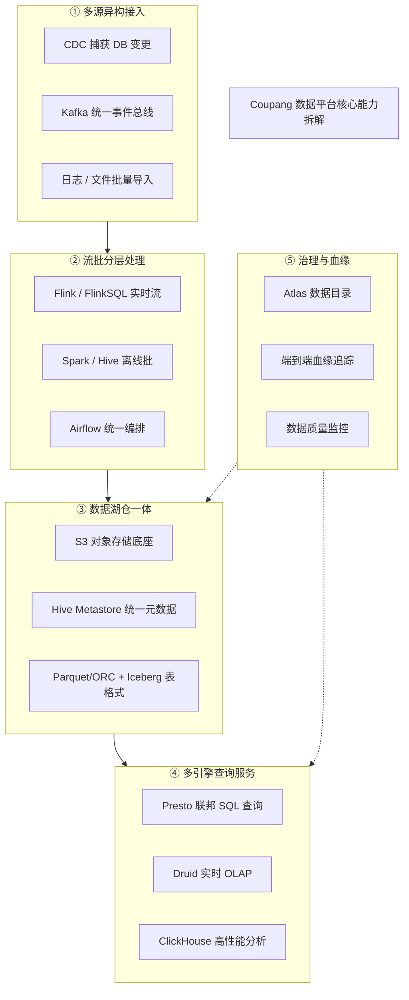
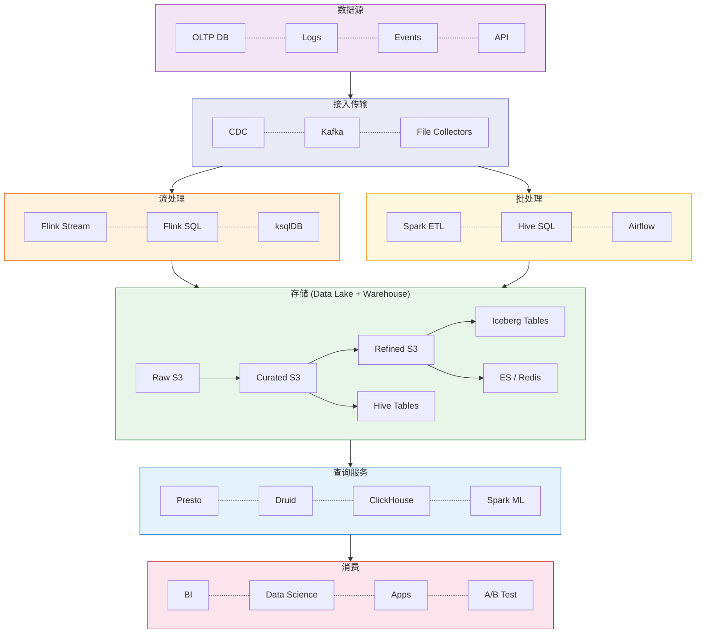

# Coupang 数据平台架构图（Mermaid 复刻）

## 架构总览

```mermaid
graph TB
    %% ===== SOURCES =====
    subgraph SRC[" Data Sources "]
        direction LR
        rdbms[("RDBMS<br/>OLTP DBs")]
        applog["Application<br/>Logs"]
        clickstream["Clickstream<br/>User Behavior"]
        extapi["External<br/>APIs"]
        files["File/CSV<br/>Ingestion"]
    end

    %% ===== INGESTION =====
    subgraph INGEST[" Data Ingestion / Transport "]
        direction LR
        kafka["Apache Kafka<br/>Real-time Event Bus"]
        flinkcdc["Flink CDC<br/>Change Data Capture"]
        filebeat["Filebeat / Fluentd<br/>Log Collector"]
    end

    %% ===== STREAM PROCESSING =====
    subgraph STREAM[" Stream Processing (Real-time) "]
        direction LR
        flink["Apache Flink<br/>Stream Processing"]
        flinksql["Flink SQL<br/>Stream Analytics"]
        ksqldb["ksqlDB<br/>Stream SQL"]
    end

    %% ===== BATCH PROCESSING =====
    subgraph BATCH[" Batch Processing "]
        direction LR
        spark["Apache Spark<br/>Batch ETL"]
        hiveproc["Hive / Tez<br/>SQL Batch"]
        airflow["Apache Airflow<br/>Workflow Orchestration"]
    end

    %% ===== STORAGE LAYER =====
    subgraph STORE[" Storage Layer (Data Lake & Warehouse) "]
        direction TB
        
        subgraph DL[" Data Lake (S3/MinIO) "]
            direction LR
            raw["Raw Zone<br/>原始数据"]
            curated["Curated Zone<br/>清洗后数据"]
            refined["Refined Zone<br/>聚合数据"]
        end

        subgraph DW[" Data Warehouse "]
            direction LR
            hive_meta["Hive Metastore<br/>Table Metadata"]
            hive_tbl["Hive Tables<br/>Parquet / ORC"]
            iceberg["Iceberg / Hudi<br/>Table Format"]
        end

        subgraph CACHE[" Caching / Indexing "]
            direction LR
            redis["Redis<br/>Real-time Cache"]
            es["Elasticsearch<br/>Search Index"]
        end
    end

    %% ===== SERVING =====
    subgraph SERVE[" Data Serving / Query Engines "]
        direction LR
        presto["Presto / Trino<br/>Federated SQL"]
        druid["Apache Druid<br/>Real-time OLAP"]
        clickhouse["ClickHouse<br/>OLAP"]
        sparkml["Spark ML<br/>Machine Learning"]
    end

    %% ===== CONSUMPTION =====
    subgraph CONSUME[" Data Consumption "]
        direction LR
        tableau["Tableau / Superset<br/>BI Dashboards"]
        datasci["Jupyter / Notebooks<br/>Data Science"]
        apps["Internal Apps<br/>Data Products"]
        abtest["A/B Testing<br/>Experimentation"]
    end

    %% ===== GOVERNANCE =====
    subgraph GOV[" Data Governance "]
        direction LR
        catalog["Data Catalog<br/>Atlas / Amundsen"]
        lineage["Data Lineage<br/>Blood Tracking"]
        quality["Data Quality<br/>Great Expectations"]
        rbac["RBAC / ACL<br/>Access Control"]
    end

    %% ===== DATA FLOWS =====
    rdbms --> flinkcdc
    applog --> filebeat
    clickstream --> kafka
    extapi --> kafka
    files --> spark

    flinkcdc --> kafka
    filebeat --> kafka

    kafka --> flink
    kafka --> flinksql
    kafka --> ksqldb

    flink --> raw
    flinksql --> raw
    ksqldb --> raw

    raw --> spark
    raw --> hiveproc
    spark --> curated
    hiveproc --> curated
    curated --> refined

    curated --> hive_meta
    refined --> hive_meta
    hive_meta --> hive_tbl
    hive_meta --> iceberg

    flink --> redis
    spark --> es

    hive_tbl --> presto
    iceberg --> presto
    hive_tbl --> druid
    hive_tbl --> clickhouse
    raw --> sparkml

    presto --> tableau
    druid --> tableau
    clickhouse --> tableau
    presto --> datasci
    sparkml --> datasci
    presto --> apps
    raw --> abtest

    airflow -.-> spark
    airflow -.-> hiveproc
    airflow -.-> flink

    catalog -.- hive_meta
    lineage -.- hive_meta
    quality -.- curated
    rbac -.- hive_tbl

    %% ===== STYLES =====
    style SRC fill:#f3e5f5,stroke:#7b1fa2,stroke-width:2px
    style INGEST fill:#e8eaf6,stroke:#3949ab,stroke-width:2px
    style STREAM fill:#fff3e0,stroke:#e65100,stroke-width:2px
    style BATCH fill:#fff8e1,stroke:#f9a825,stroke-width:2px
    style STORE fill:#e8f5e9,stroke:#2e7d32,stroke-width:2px
    style DL fill:#c8e6c9,stroke:#43a047,stroke-width:1px
    style DW fill:#a5d6a7,stroke:#2e7d32,stroke-width:1px
    style CACHE fill:#81c784,stroke:#388e3c,stroke-width:1px
    style SERVE fill:#e3f2fd,stroke:#1565c0,stroke-width:2px
    style CONSUME fill:#fce4ec,stroke:#c62828,stroke-width:2px
    style GOV fill:#f5f5f5,stroke:#78909c,stroke-width:2px
```

## Coupang 架构的关键特点

```mermaid
graph TB
    title["Coupang 数据平台核心能力拆解"]

    subgraph A["① 多源异构接入"]
        a1["CDC 捕获 DB 变更"]
        a2["Kafka 统一事件总线"]
        a3["日志 / 文件批量导入"]
    end

    subgraph B["② 流批分层处理"]
        b1["Flink / FlinkSQL 实时流"]
        b2["Spark / Hive 离线批"]
        b3["Airflow 统一编排"]
    end

    subgraph C["③ 数据湖仓一体"]
        c1["S3 对象存储底座"]
        c2["Hive Metastore 统一元数据"]
        c3["Parquet/ORC + Iceberg 表格式"]
    end

    subgraph D["④ 多引擎查询服务"]
        d1["Presto 联邦 SQL 查询"]
        d2["Druid 实时 OLAP"]
        d3["ClickHouse 高性能分析"]
    end

    subgraph E["⑤ 治理与血缘"]
        e1["Atlas 数据目录"]
        e2["端到端血缘追踪"]
        e3["数据质量监控"]
    end

    A --> B --> C --> D
    E -.-> C
    E -.-> D
```

## 分层简化视图

```mermaid
graph TB
    subgraph L1[" 数据源 "]
        s1["OLTP DB"] -.- s2["Logs"] -.- s3["Events"] -.- s4["API"]
    end

    subgraph L2[" 接入传输 "]
        i1["CDC"] -.- i2["Kafka"] -.- i3["File Collectors"]
    end

    subgraph L3[" 流处理 "]
        st1["Flink Stream"] -.- st2["Flink SQL"] -.- st3["ksqlDB"]
    end

    subgraph L4[" 批处理 "]
        bt1["Spark ETL"] -.- bt2["Hive SQL"] -.- bt3["Airflow"]
    end

    subgraph L5[" 存储 (Data Lake + Warehouse) "]
        r1["Raw S3"] --> r2["Curated S3"] --> r3["Refined S3"]
        r2 --> dw1["Hive Tables"]
        r3 --> dw2["Iceberg Tables"]
        r3 --> idx["ES / Redis"]
    end

    subgraph L6[" 查询服务 "]
        q1["Presto"] -.- q2["Druid"] -.- q3["ClickHouse"] -.- q4["Spark ML"]
    end

    subgraph L7[" 消费 "]
        c1["BI"] -.- c2["Data Science"] -.- c3["Apps"] -.- c4["A/B Test"]
    end

    L1 --> L2
    L2 --> L3
    L2 --> L4
    L3 --> L5
    L4 --> L5
    L5 --> L6
    L6 --> L7

    style L1 fill:#f3e5f5,stroke:#7b1fa2
    style L2 fill:#e8eaf6,stroke:#3949ab
    style L3 fill:#fff3e0,stroke:#e65100
    style L4 fill:#fff8e1,stroke:#f9a825
    style L5 fill:#e8f5e9,stroke:#2e7d32
    style L6 fill:#e3f2fd,stroke:#1565c0
    style L7 fill:#fce4ec,stroke:#c62828
```
