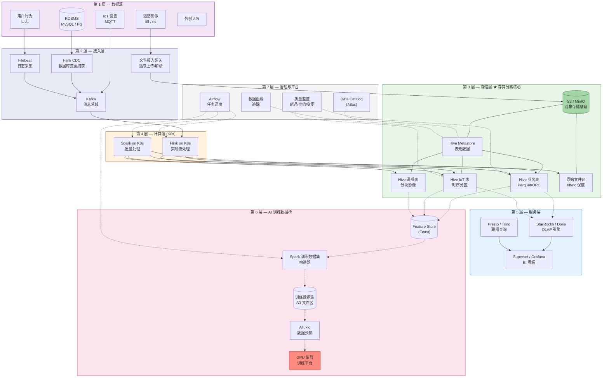
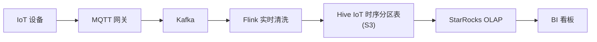
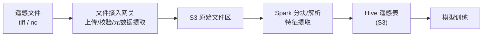
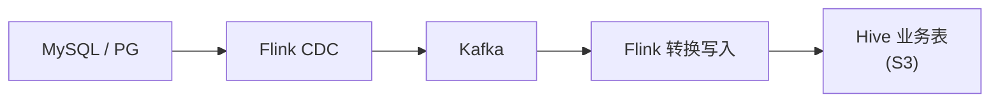
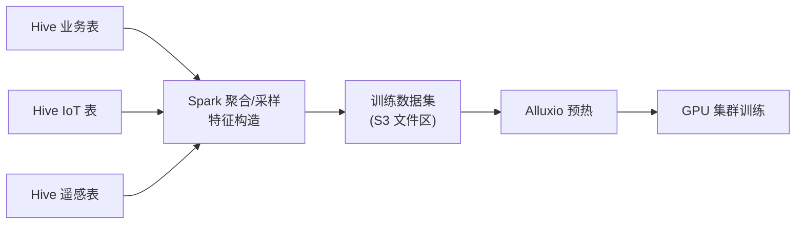
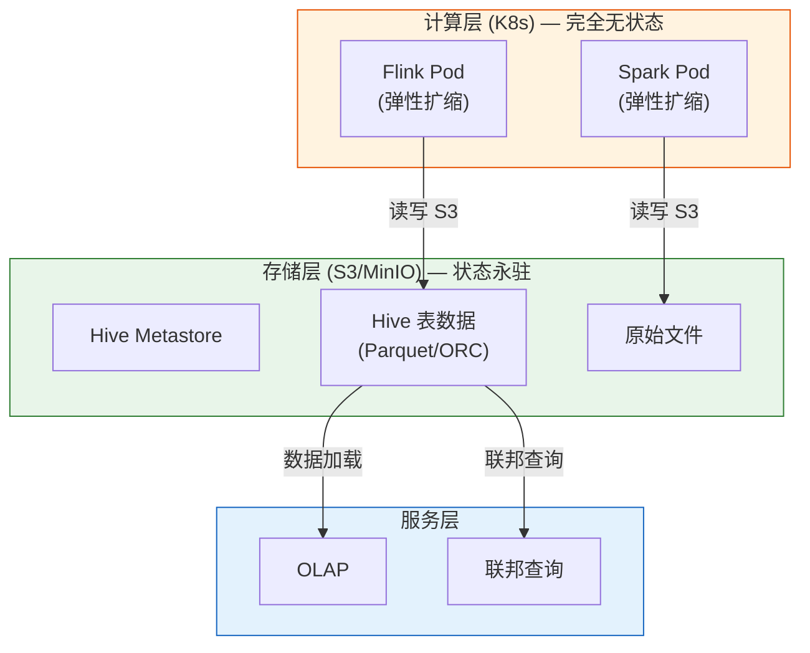

# 存算分离数据平台架构图

## 架构总览

```mermaid
graph TB
    %% ========== 第 7 层：治理与平台 ==========
    subgraph L7[" 第 7 层 — 治理与平台 "]
        direction LR
        airflow["Airflow<br/>任务调度"]
        atlas["Data Catalog<br/>(Atlas)"]
        lineage["数据血缘<br/>追踪"]
        quality["质量监控<br/>延迟/空值/变更"]
    end

    %% ========== 第 1 层：数据源 ==========
    subgraph L1[" 第 1 层 — 数据源 "]
        direction LR
        rdbms[("RDBMS<br/>MySQL / PG")]
        log["用户行为<br/>日志"]
        iot["IoT 设备<br/>MQTT"]
        rs["遥感影像<br/>tiff / nc"]
        api["外部 API"]
    end

    %% ========== 第 2 层：接入层 ==========
    subgraph L2[" 第 2 层 — 接入层 "]
        direction LR
        kafka["Kafka<br/>消息总线"]
        flinkcdc["Flink CDC<br/>数据库变更捕获"]
        filebeat["Filebeat<br/>日志采集"]
        fgateway["文件接入网关<br/>遥感上传/解析"]
    end

    %% ========== 第 3 层：存储层 ==========
    subgraph L3[" 第 3 层 — 存储层 ★ 存算分离核心 "]
        direction TB
        s3[("S3 / MinIO<br/>对象存储底座")]
        hive_meta["Hive Metastore<br/>表元数据"]
        hive_biz["Hive 业务表<br/>Parquet/ORC"]
        hive_iot["Hive IoT 表<br/>时序分区"]
        hive_rs["Hive 遥感表<br/>分块影像"]
        raw["原始文件区<br/>tiff/nc 保底"]
        s3 --- hive_meta
        hive_meta --- hive_biz
        hive_meta --- hive_iot
        hive_meta --- hive_rs
        s3 --- raw
    end

    %% ========== 第 4 层：计算层 ==========
    subgraph L4[" 第 4 层 — 计算层 (K8s) "]
        direction LR
        flink["Flink on K8s<br/>实时流处理"]
        spark["Spark on K8s<br/>批量处理"]
    end

    %% ========== 第 5 层：服务层 ==========
    subgraph L5[" 第 5 层 — 服务层 "]
        direction LR
        starrocks["StarRocks / Doris<br/>OLAP 引擎"]
        trino["Presto / Trino<br/>联邦查询"]
        bi["Superset / Grafana<br/>BI 看板"]
    end

    %% ========== 第 6 层：AI 训练桥 ==========
    subgraph L6[" 第 6 层 — AI 训练数据桥 "]
        direction LR
        feature[("Feature Store<br/>(Feast)")]
        train_builder["Spark 训练数据集<br/>构造器"]
        train_s3[("训练数据集<br/>S3 文件区")]
        alluxio["Alluxio<br/>数据预热"]
        gpu["GPU 集群<br/>训练平台"]
    end

    %% ========== 数据流向 ==========
    rdbms --> flinkcdc
    log --> filebeat
    iot --> kafka
    rs --> fgateway

    flinkcdc --> kafka
    filebeat --> kafka
    fgateway --> s3

    kafka --> flink
    flink --> hive_iot
    flink --> hive_biz
    spark --> hive_biz
    spark --> hive_iot
    spark --> hive_rs
    spark --> raw

    hive_biz -.-> starrocks
    hive_iot -.-> starrocks
    starrocks --> bi
    trino --> bi

    hive_biz -.-> feature
    hive_iot -.-> feature
    hive_rs -.-> feature
    feature -.-> train_builder
    train_builder -.-> train_s3
    train_s3 -.-> alluxio
    alluxio -.-> gpu

    %% ========== 治理层关联 ==========
    airflow -.-> flink
    airflow -.-> spark
    airflow -.-> train_builder
    atlas -.- hive_meta
    lineage -.- hive_meta
    quality -.- hive_iot
    quality -.- hive_biz

    %% 样式
    style L1 fill:#f3e5f5,stroke:#7b1fa2
    style L2 fill:#e8eaf6,stroke:#3949ab
    style L3 fill:#e8f5e9,stroke:#2e7d32
    style L4 fill:#fff3e0,stroke:#e65100
    style L5 fill:#e3f2fd,stroke:#1565c0
    style L6 fill:#fce4ec,stroke:#c62828
    style L7 fill:#f5f5f5,stroke:#546e7a
    style s3 fill:#a5d6a7,stroke:#1b5e20
    style gpu fill:#ff8a80,stroke:#b71c1c
```

## 四大数据链路

### 链路 1：IoT 实时链路

```mermaid
graph LR
    iot["IoT 设备"] --> mqtt["MQTT 网关"]
    mqtt --> kafka["Kafka"]
    kafka --> flink["Flink 实时清洗"]
    flink --> hive["Hive IoT 时序分区表<br/>(S3)"]
    hive --> sr["StarRocks OLAP"]
    sr --> bi["BI 看板"]
```

### 链路 2：遥感批量链路

```mermaid
graph LR
    rs["遥感文件<br/>tiff / nc"] --> gw["文件接入网关<br/>上传/校验/元数据提取"]
    gw --> s3["S3 原始文件区"]
    s3 --> spark["Spark 分块/解析<br/>特征提取"]
    spark --> hive["Hive 遥感表<br/>(S3)"]
    hive --> model["模型训练"]
```

### 链路 3：CDC 实时链路

```mermaid
graph LR
    db["MySQL / PG"] --> cdc["Flink CDC"]
    cdc --> kafka["Kafka"]
    kafka --> flink["Flink 转换写入"]
    flink --> hive["Hive 业务表<br/>(S3)"]
```

### 链路 4：AI 训练数据构造链路

```mermaid
graph LR
    biz["Hive 业务表"] --> spark["Spark 聚合/采样<br/>特征构造"]
    iot_t["Hive IoT 表"] --> spark
    rs_t["Hive 遥感表"] --> spark
    spark --> ds["训练数据集<br/>(S3 文件区)"]
    ds --> allux["Alluxio 预热"]
    allux --> gpu["GPU 集群训练"]
```

## 存算分离示意

```mermaid
graph TB
    subgraph STORAGE[" 存储层 (S3/MinIO) — 状态永驻 "]
        direction LR
        s3_meta["Hive Metastore"]
        s3_data["Hive 表数据<br/>(Parquet/ORC)"]
        s3_file["原始文件"]
    end

    subgraph COMPUTE[" 计算层 (K8s) — 完全无状态 "]
        direction LR
        pod1["Flink Pod<br/>(弹性扩缩)"]
        pod2["Spark Pod<br/>(弹性扩缩)"]
    end

    subgraph SERVE[" 服务层 "]
        direction LR
        olap["OLAP"]
        query["联邦查询"]
    end

    pod1 -->|"读写 S3"| s3_data
    pod2 -->|"读写 S3"| s3_file
    s3_data -->|"数据加载"| olap
    s3_data -->|"联邦查询"| query

    style STORAGE fill:#e8f5e9,stroke:#2e7d32
    style COMPUTE fill:#fff3e0,stroke:#e65100
    style SERVE fill:#e3f2fd,stroke:#1565c0
```
